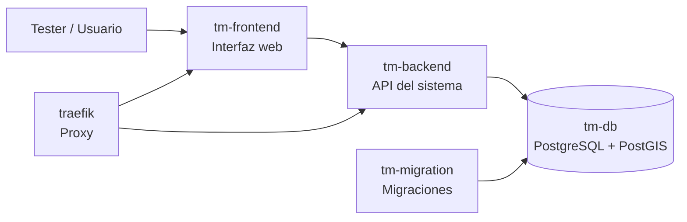

<div align="center">
  <h3>UNIVERSIDAD NACIONAL DE SAN AGUSTÍN</h3>
  <h4>FACULTAD DE INGENIERÍA DE PRODUCCIÓN Y SERVICIOS</h4>
  <h4>ESCUELA PROFESIONAL DE INGENIERÍA DE SISTEMAS</h4>
  <br>
  
  <br><br>
  <b>Curso:</b> Pruebas de Software <br>
  <b>Docente:</b> Ing. Robert Edison Arisaca Mamani <br>
  <b>Semestre:</b> VII <br>
  <b>Proyecto:</b> HOT Tasking Manager — Entorno de Pruebas <br>
  <b>Fecha de Elaboración:</b> 12/06/2026 <br>
  <b>Arequipa — Perú</b>
</div>

---

# Entorno de Pruebas 

Este documento describe el entorno de pruebas utilizado para el proyecto **Tasking Manager**. El objetivo es que todos los integrantes del equipo puedan levantar y probar el sistema bajo las mismas condiciones, usando una configuración común basada en **Docker Compose**.

El entorno permite ejecutar el sistema de forma local, incluyendo la interfaz web, el backend, la base de datos, las migraciones y los servicios necesarios para que la aplicación funcione correctamente durante las pruebas.

---

## 1. Objetivo del entorno

El entorno de pruebas busca garantizar que las pruebas funcionales, unitarias e integrales se realicen sobre una misma configuración técnica.

De esta manera, se evita que cada integrante pruebe el sistema en condiciones diferentes, como distintas versiones de Python, PostgreSQL, dependencias o configuraciones locales.

---

## 2. Arquitectura general del entorno

El proyecto proporciona un entorno compuesto por varios contenedores Docker. Cada contenedor cumple una función específica dentro del sistema.



El usuario accede al sistema desde el navegador. El frontend muestra la interfaz web y se comunica con el backend. El backend procesa las operaciones del sistema y guarda la información en la base de datos PostgreSQL con PostGIS.

---

## 3. Servicios principales del entorno

| Servicio       | Función                                                            |
| :------------- | :----------------------------------------------------------------- |
| `tm-frontend`  | Muestra la interfaz web del Tasking Manager.                       |
| `tm-backend`   | Ejecuta la API y la lógica principal del sistema.                  |
| `tm-db`        | Almacena la información del sistema en PostgreSQL/PostGIS.         |
| `tm-migration` | Ejecuta las migraciones necesarias para preparar la base de datos. |
| `traefik`      | Gestiona el acceso y enrutamiento hacia los servicios.             |
| `tm-cron-jobs` | Ejecuta tareas programadas del sistema.                            |

---

## 4. Versiones verificadas

### Backend (`tm-backend`)

* **Python:** `3.10.20`
* **Framework:** FastAPI / Uvicorn
* **Migraciones:** Alembic `1.11.1`

### Frontend (`tm-frontend`)

* **Servidor web:** Nginx `1.31.1`

### Base de datos (`tm-db`)

* **PostgreSQL:** `14.9`
* **PostGIS:** `3.3.4`

### Proxy (`traefik`)

* **Traefik:** `3.6.1`

---

## 5. Variables de entorno principales

Las variables principales se definen en el archivo:

```txt
tasking-manager.env
```

| Variable            | Valor                |
| :------------------ | :------------------- |
| `POSTGRES_DB`       | `tasking-manager`    |
| `POSTGRES_USER`     | `tm`                 |
| `POSTGRES_PASSWORD` | `tm`                 |
| `POSTGRES_TEST_DB`  | `taskingmanagertest` |

Estas variables permiten que el backend, la base de datos y las pruebas trabajen con una configuración común.

---

## 6. Cómo levantar el entorno

Desde la raíz del proyecto

Levantar los servicios:

```powershell
docker compose up -d
```

Verificar el estado de los contenedores:

```powershell
docker compose ps
```

Acceder al sistema desde el navegador:

```txt
http://127.0.0.1:3000
```

---

## 7. Criterios para considerar el entorno listo

El entorno se considera listo para ejecutar pruebas cuando:

| Criterio      | Resultado esperado                                 |
| :------------ | :------------------------------------------------- |
| Base de datos | `tm-db` aparece en estado saludable.               |
| Backend       | `tm-backend` se encuentra levantado correctamente. |
| Frontend      | La aplicación carga desde `http://127.0.0.1:3000`. |
| Migraciones   | `tm-migration` finaliza sin errores.               |
| Comunicación  | El frontend puede comunicarse con el backend.      |

---


