  
Universidad Nacional de San Agustín

  
Facultad de Ingeniería de Producción y Servicios

  
Escuela Profesional de Ingeniería de Sistemas

  

    
  

  

    <table>
      <tr><td class="label">Curso</td><td>Pruebas de Software</td></tr>
      <tr><td class="label">Docente</td><td>Ing. Robert Edison Arisaca Mamani</td></tr>
      <tr><td class="label">Semestre</td><td>VII</td></tr>
      <tr><td class="label">Proyecto</td><td>HOT Tasking Manager — Especificación de Infraestructura y Entorno de Pruebas de Integración</td></tr>
      <tr><td class="label">Fecha</td><td>15/07/2026</td></tr>
    </table>
  

  
Arequipa — Perú

  

---

  
# Especificación de Infraestructura y Entorno de Pruebas de Integración

Este documento detalla la arquitectura técnica, los componentes y el ciclo de vida del entorno requerido para la ejecución automatizada y reproducible de las pruebas de integración del backend del **Tasking Manager**.

---

## 1. Propósito del Entorno de Pruebas

Para aislar las pruebas de integración y evitar la contaminación del entorno de desarrollo local o producción, se ha diseñado una infraestructura basada en bases de datos efímeras y orquestación por contenedores. Su propósito central es garantizar un entorno determinista donde cada prueba inicie con un estado conocido y limpio.

---

## 2. Orquestación y Componentes (Docker Compose)

El ciclo de vida del entorno de pruebas se gestiona a través de Docker Compose (`docker-compose.yml`).

| Componente | Rol en las Pruebas de Integración | Configuración Específica |
| :--- | :--- | :--- |
| **Backend API (FastAPI)** | Servidor de pruebas (`tm-backend`). | Expuesto en el puerto 5000, con recarga en caliente desactivada para optimizar memoria en CI. |
| **Base de Datos (PostgreSQL 14)** | Persistencia real del motor PostGIS. | Red dedicada `tm-net`. |
| **Proxy Reverso (Traefik)** | Simulación de la capa de enrutamiento. | Valida que las rutas API (`/api/v2/`) se expongan correctamente como en producción. |

---

## 3. Arquitectura del Motor de Pruebas (`conftest.py`)

El archivo `conftest.py` en la raíz de la carpeta `tests/` es el orquestador técnico crítico que habilita las pruebas de integración en Python, implementando el patrón de **Base de Datos Efímera** y **Transacciones Reversibles**.

### Flujo de Ejecución del Entorno

```mermaid
graph TD
    A[Inicio Session Pytest] --> B[Crear BD de Test Física]
    B --> C[Aplicar Migraciones Alembic / Crear Tablas]
    C --> D[Instalar Extensiones PostGIS]
    D --> E{Ejecutar Suite de Integración}
    E -- Cada Test Individual --> F[Forzar Rollback Automático]
    F -- Limpieza --> G[Destruir BD de Test `_test`]
```

### Decisiones Técnicas Implementadas:

1.  **Aislamiento Físico (`_test` database):**
    *   *Implementación:* Al inicio de la sesión, se duplica el esquema configurando la conexión con un sufijo de pruebas (por ejemplo, `tasking_manager_test`).
    *   *Justificación:* Previene la destrucción accidental de los datos de los desarrolladores durante la ejecución local de la suite de integración.
2.  **Transacciones Reversibles (`force_rollback=True`):**
    *   *Implementación:* El motor inyecta un conector SQLAlchemy que inicia una transacción en la base de datos que nunca llega a confirmarse (`commit`). Al terminar la función de prueba, se realiza un *rollback* forzado.
    *   *Justificación:* Otorga independencia absoluta a los casos de prueba. El test *B* nunca fallará por culpa de datos residuales insertados por el test *A*.
3.  **Cliente ASGI (FastAPI TestClient / HTTPX):**
    *   *Implementación:* Las peticiones HTTP no pasan por la red local, sino que invocan directamente la aplicación ASGI en memoria usando `httpx.AsyncClient`.
    *   *Justificación:* Minimiza la latencia de red, acelerando la ejecución de los cientos de tests de integración.

---

## 4. Gestión de Configuración y Mocking

### Configuración Dinámica (`config.py` y `Settings`)
El entorno de pruebas sobreescribe variables críticas usando Pydantic Settings. Las credenciales de base de datos se alteran dinámicamente para apuntar a los contenedores Docker mediante el uso de variables de entorno configuradas por `pytest-env`.

### Simulación de Dependencias Externas (Mocking)
Dado que las pruebas de integración evalúan el backend y su base de datos, el entorno debe cortar la comunicación real con servidores de terceros para evitar errores por tiempos de espera o cuotas de API.

*   **OAuth2 OSM:** Interceptado mediante simulación a nivel de `AuthenticationService`.
*   **SMTP (Correos):** El módulo de envío de correos opera en modo *dummy* o se utiliza captura de salida (log capture) para validar el contenido del mensaje sin intentar entregarlo.

---

## 5. Integración Continua (CI/CD)

El entorno diseñado localmente se replica 1:1 en GitHub Actions.
1. Se levantan los servicios de PostgreSQL/PostGIS.
2. Se inyectan las credenciales.
3. Se ejecuta el comando `pytest tests/api/integration/` con el plugin `pytest-cov` para generar los artefactos de métricas de cobertura.

