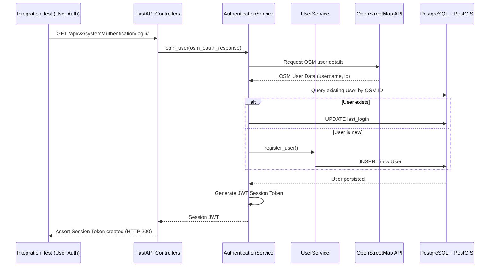

<div align="center">
  <h3>UNIVERSIDAD NACIONAL DE SAN AGUSTÍN</h3>
  <h4>FACULTAD DE INGENIERÍA DE PRODUCCIÓN Y SERVICIOS</h4>
  <h4>ESCUELA PROFESIONAL DE INGENIERÍA DE SISTEMAS</h4>
  <br>
  
  <br><br>
  <b>Curso:</b> Pruebas de Software <br>
  <b>Docente:</b> Ing. Robert Edison Arisaca Mamani <br>
  <b>Semestre:</b> VII <br>
  <b>Proyecto:</b> HOT Tasking Manager — Módulo de Usuarios y Autenticación (User Management) <br>
  <b>Fecha de Elaboración:</b> 15/07/2026 <br>
  <b>Arequipa — Perú</b>
</div>

---

# Módulo de Usuarios y Autenticación (User Management)

## 1. Criterio de Selección

Para que un archivo de prueba sea considerado parte de este módulo, debe cumplir al menos uno de los siguientes requisitos:
1.  **Gestión de Identidad y Perfil:** El test debe validar operaciones relacionadas con la creación de la cuenta, actualización de intereses, roles, datos de contacto (email) y visibilidad de información personal.
2.  **Autenticación y Autorización:** El test debe verificar la conexión con OpenStreetMap (OSM) para el inicio de sesión, la generación y verificación de tokens JWT, o las políticas de roles de acceso.
3.  **Niveles de Experiencia y Recompensas:** El test debe interactuar con el recálculo de *Mapping Levels* de los mappers o la simulación de insignias (*Badges*).
4.  **Exposición de Recursos de Usuarios:** El punto de entrada debe ser un endpoint diseñado para consultar o mutar perfiles ubicado en `backend/api/users/`.

---

## 2. Listado de suites de pruebas de integración actuales

El conjunto completo para el módulo **Usuarios y Autenticación** consta de **8 archivos**.

### Archivos Incluidos

| Archivo de Prueba | Justificación de Inclusión |
| :--- | :--- |
| `api/users/test_actions.py` | Valida acciones restrictivas sobre el usuario: asignación de rol por administradores, verificación de correos y permisos HTTP 403. |
| `api/users/test_openstreetmap.py` | Cubre el flujo de callbacks, autorizaciones y manejo de errores 502 al interactuar con el login de OSM. |
| `api/users/test_resources.py` | Valida las reglas de privacidad de datos, obtención de perfil ajeno frente a propio y filtros paginados. |
| `api/users/test_statistics.py` | Valida la recuperación temporal del historial de mapeo y lectura del estado de la experiencia del mapper. |
| `services/users/test_authentication_service.py` | Prueba la lógica aislada de login; determina si el usuario existe o si es su primer registro (*User Create*). |
| `services/users/test_osm_service.py` | Evalúa las llamadas directas de sincronización al servicio externo de OpenStreetMap. |
| `services/users/test_user_service.py` | Prueba el algoritmo central de salto de nivel (*Mapping Level*), simulando hitos de mapeo sin dependencia de red HTTP. |
| `models/test_user.py` | Evalúa directamente la serialización segura a DTO (Data Transfer Object), asegurando que el correo electrónico no sea expuesto públicamente. |

### Archivos Excluidos

*   `api/projects/*`: Se excluyen porque administran el ciclo de vida, campañas y gestión de proyectos, lo que pertenece al **Módulo de Gestión de Proyectos**.
*   `api/tasks/*`: Se excluyen porque validan la creación, división y estado cartográfico de una tarea en el editor geográfico, no la identidad del usuario en sí.

---

## 3. Análisis Funcional por Archivo

### A. Autenticación y Login (`api/users/test_openstreetmap.py`, `services/users/test_authentication_service.py`)
*   **Objetivo:** Garantizar que la entrada al sistema mediante OAuth sea robusta y las sesiones se validen criptográficamente.
*   **Flujos Cubiertos:** Callback de OSM, creación transparente de usuario al primer login, generación de JWT, validación de token.
*   **Componentes:** `AuthenticationService`, `OSMService`, endpoints de login en OSM.

### B. Consulta de Perfiles y Privacidad (`api/users/test_resources.py`, `models/test_user.py`)
*   **Objetivo:** Verificar que el acceso a datos sensibles (correo, género) respete las reglas de propiedad y se ejecuten consultas correctas.
*   **Flujos Cubiertos:** Petición del propio perfil, ocultación de datos a terceros, listado general de contribuidores.
*   **Componentes:** `UserService`, `User` (Modelo PostGIS).

### C. Administración y Acciones del Usuario (`api/users/test_actions.py`)
*   **Objetivo:** Comprobar que los cambios de estado interno y roles administrativos funcionen correctamente.
*   **Flujos Cubiertos:** Cambios de rol (Mappers a Admins), validación de correos, actualización de intereses, control de roles inválidos.
*   **Componentes:** `UserService`, middlewares de autorización.

### D. Reglas de Negocio de Identidad y Experiencia (`services/users/test_user_service.py`)
*   **Objetivo:** Probar el core del dominio, específicamente la progresión del *Mapper*.
*   **Flujos Cubiertos:** Salto de nivel (*Beginner* a *Intermediate*), asignación de atributos y actualización de perfiles en la base de datos.
*   **Componentes:** `UserService`, simulaciones de `MappingBadge`.

---

## 4. Diagrama de Interacción de las Pruebas de Integración

Este diagrama muestra cómo los tests de este módulo ejercen múltiples capas y componentes del sistema:



---

## 5. Alcance

El alcance actual de las pruebas de integración para el módulo **Usuarios y Autenticación** es **excelente** en la capa de seguridad perimetral, pero presenta áreas de mejora en el procesamiento de búsquedas y recompensas.

| Dimensión | Alcance | Nivel de Confianza | Observaciones |
| :--- | :--- | :--- | :--- |
| **Inicio de Sesión y Autenticación** | 90% | **Muy Alto** | La suma de `openstreetmap.py` y `authentication_service.py` brinda gran seguridad en la puerta de entrada. |
| **Persistencia de Entidad de Usuario** | 81% | **Alto** | `user.py` se validó exhaustivamente, asegurando que los datos sensibles (ej. correo) no se fuguen. |
| **Gestión de Roles Administrativos** | 70% | **Medio-Alto** | Se aseguran las respuestas HTTP 403 para proteger roles críticos. |
| **Cálculo de Mapping Levels** | 65% | **Medio** | Cubre progresiones normales, pero ignora fluctuaciones extremas de estadísticas. |
| **Búsqueda y Paginación** | 45% | **Bajo** | Gran parte de las mutaciones de queries HTTP están sin probar en `resources.py`. |
| **Otorgamiento de Badges** | 10% | **Bajo** | Alta dependencia en simulaciones (*mocks*) para la persistencia transaccional de recompensas. |

**Conclusión del Estado Actual:**
Las pruebas de integración actuales establecen un cerco de seguridad perimetral excelente sobre el Módulo de Usuarios y Autenticación. Garantizan que los colaboradores y sus accesos iniciales estén blindados (ej. 100% en flujos OAuth con OSM). Sin embargo, para escalar a un modelo de excelencia técnica superior, el módulo requiere abandonar las simulaciones transaccionales en el otorgamiento de insignias (*Badges*) e implementar casos de prueba combinados para los filtros de búsqueda de contribuidores.

---

## 6. Ejecución de pruebas funcionales previa

Hemos ejecutado las pruebas de integración previamente para cobertura del módulo.

```sh
PS E:\Ing. Sistemas\4to_año\PS\Proyecto_Final\gestor-tareas-pruebas> docker compose exec tm-backend coverage run -m pytest tests/api/integration/api/users/test_resources.py tests/api/integration/api/users/test_actions.py tests/api/integration/api/users/test_statistics.py tests/api/integration/api/users/test_openstreetmap.py tests/api/integration/services/users/test_authentication_service.py tests/api/integration/services/users/test_user_service.py tests/api/integration/services/users/test_osm_service.py tests/api/integration/models/test_user.py -p no:warnings
time="2026-07-04T02:40:42-05:00" level=warning msg="The \"DEFAULT_VALIDATOR_TEAM_ID\" variable is not set. Defaulting to a blank string."
time="2026-07-04T02:40:42-05:00" level=warning msg="The \"DEFAULT_VALIDATOR_TEAM_ID\" variable is not set. Defaulting to a blank string."
==================================================== test session starts =====================================================
platform linux -- Python 3.10.20, pytest-8.3.5, pluggy-1.5.0
rootdir: /usr/src/app
configfile: pyproject.toml
plugins: anyio-4.9.0, cov-7.1.0
collected 83 items                                                                                                           

tests/api/integration/api/users/test_resources.py .............................                                        [ 34%]
tests/api/integration/api/users/test_actions.py .....................                                                  [ 60%]
tests/api/integration/api/users/test_statistics.py .........                                                           [ 71%]
tests/api/integration/api/users/test_openstreetmap.py ....                                                             [ 75%]
tests/api/integration/services/users/test_authentication_service.py ..........                                         [ 87%]
tests/api/integration/services/users/test_user_service.py ......                                                       [ 95%]
tests/api/integration/services/users/test_osm_service.py ..                                                            [ 97%]
tests/api/integration/models/test_user.py ..                                                                           [100%]

=============================================== 83 passed in 71.56s (0:01:11) ================================================
```

```sh
PS E:\Ing. Sistemas\4to_año\PS\Proyecto_Final\gestor-tareas-pruebas> docker compose exec tm-backend coverage report -m --include="backend/api/users/actions.py,backend/api/users/openstreetmap.py,backend/api/users/resources.py,backend/api/users/statistics.py,backend/services/users/authentication_service.py,backend/services/users/osm_service.py,backend/services/users/user_service.py,backend/models/postgis/user.py"
time="2026-07-04T02:42:36-05:00" level=warning msg="The \"DEFAULT_VALIDATOR_TEAM_ID\" variable is not set. Defaulting to a blank string."
time="2026-07-04T02:42:36-05:00" level=warning msg="The \"DEFAULT_VALIDATOR_TEAM_ID\" variable is not set. Defaulting to a blank string."
Name                                               Stmts   Miss  Cover   Missing
--------------------------------------------------------------------------------
backend/api/users/__init__.py                          0      0   100%
backend/api/users/actions.py                          83     27    67%   90, 101-103, 161-165, 243-248, 270-274, 319-323, 404-405
backend/api/users/openstreetmap.py                    16      0   100%
backend/api/users/resources.py                       119     61    49%   84-111, 204-205, 214-294, 325-326, 536-546
backend/api/users/statistics.py                       68     28    59%   100-101, 153, 191-230, 244
backend/models/postgis/user.py                       325     63    81%   130-131, 173-175, 210-211, 223, 238, 273-276, 331-350, 359-411, 448-462, 468-473, 540, 545, 558-576, 580-586, 612-619, 623, 638-643, 647, 679, 696-708, 712
backend/services/users/__init__.py                     0      0   100%
backend/services/users/authentication_service.py     188     55    71%   39-40, 55-57, 61-62, 79, 82-86, 92-93, 165, 185-187, 210-211, 228, 240, 244, 247-251, 254, 267-290, 298, 302, 305-308, 312, 321
backend/services/users/osm_service.py                 57     27    53%   26-34, 43-63, 76, 78, 90
backend/services/users/user_service.py               470    190    60%   107-113, 117-123, 134, 141-157, 161-168, 202-224, 305-406, 462-567, 668-669, 718, 738-742, 747, 752-754, 759-766, 771-775, 826, 831-832, 967, 982-983, 996-999, 1004-1005, 1012-1022, 1032-1033, 1056, 1064, 1073, 1077-1096, 1102-1127, 1138-1159, 1174-1186, 1195-1196, 1205, 1209-1219
--------------------------------------------------------------------------------
TOTAL                                               1326    451    66%
```


