

  <h3>UNIVERSIDAD NACIONAL DE SAN AGUSTÍN</h3>
  <h4>FACULTAD DE INGENIERÍA DE PRODUCCIÓN Y SERVICIOS</h4>
  <h4>ESCUELA PROFESIONAL DE INGENIERÍA DE SISTEMAS</h4>
   
  
    
  <b>Curso:</b> Pruebas de Software  
  <b>Docente:</b> Ing. Robert Edison Arisaca Mamani  
  <b>Semestre:</b> VII  
  <b>Proyecto:</b> HOT Tasking Manager — Documento de Pruebas  
  <b>Fecha de Elaboración:</b> 23/06/2026  
  <b>Arequipa — Perú</b>

---

### MOD-0005: Administración de Proyectos

## Resumen de Ejecución (Métricas)

| Métrica | Valor |
|---|---|
| **Casos preexistentes** | 0 |
| **Nuevos casos creados** | 25 |
| **Total de casos diseñados** | 25 |
| **Casos ejecutados con evidencia** | 25 (100%) |
| **Casos exitosos (PASS)** | 25 (100%) |
| **Casos fallidos (FAIL)** | 0 (0%) |
| **Defectos reportados** | 0 |

---

### 5.1.1. Creación de Área de Interés mediante GeoJSON válido

**CP-MOD5-001**

| ID              | Descripción                                                                                                                      | Tipo   | Estado  | Defectos                    |
| :-------------- | :------------------------------------------------------------------------------------------------------------------------------- | :----- | :------ | :-------------------------- |
| **CP-MOD5-001** | Verificar que el sistema permita definir el Área de Interés de un nuevo proyecto mediante la carga de un archivo GeoJSON válido. | Manual | Exitoso | No se encontraron defectos. |

| Resultado esperado                                                                                                                              | Resultado obtenido                                                                                                                                                                                  |
| :---------------------------------------------------------------------------------------------------------------------------------------------- | :-------------------------------------------------------------------------------------------------------------------------------------------------------------------------------------------------- |
| El sistema debe aceptar el archivo GeoJSON válido, representar el AOI en el mapa y permitir avanzar al siguiente paso de creación del proyecto. | El sistema aceptó el AOI cargado y permitió avanzar al **Paso 2: Establecer tamaños de tareas**, mostrando el área definida sobre el mapa e indicando la cantidad de tareas generadas inicialmente. |

#### Evidencia CP-MOD5-001 — Pantalla inicial de definición de AOI

  

Se observa la pantalla inicial del flujo de creación de proyecto, donde el sistema permite definir el Área de Interés mediante dibujo manual o carga de archivo geográfico.

#### Evidencia CP-MOD5-001 — AOI aceptado y avance al Paso 2

  

Se observa que el sistema aceptó correctamente el AOI definido y permitió avanzar al **Paso 2: Establecer tamaños de tareas**. Esto evidencia que la entrada válida fue procesada correctamente desde la interfaz del usuario.

### 5.1.2. Generación de grilla de tareas dentro del AOI

**CP-MOD5-002**

| ID              | Descripción                                                                                                                                                         | Tipo   | Estado  | Defectos                    |
| :-------------- | :------------------------------------------------------------------------------------------------------------------------------------------------------------------ | :----- | :------ | :-------------------------- |
| **CP-MOD5-002** | Verificar que el sistema genere una cuadrícula de tareas dentro del Área de Interés definida previamente y permita continuar con el flujo de creación del proyecto. | Manual | Exitoso | No se encontraron defectos. |

| Resultado esperado                                                                                                                                                                                   | Resultado obtenido                                                                                                                              |
| :--------------------------------------------------------------------------------------------------------------------------------------------------------------------------------------------------- | :---------------------------------------------------------------------------------------------------------------------------------------------- |
| El sistema debe generar una grilla o cuadrícula de tareas dentro del AOI definido, mostrar visualmente las tareas generadas y permitir avanzar al siguiente paso del flujo de creación del proyecto. | El sistema generó la cuadrícula de tareas sobre el AOI previamente definido y permitió avanzar al **Paso 3: Recortar la cuadrícula de tareas**. |

#### Evidencia CP-MOD5-002 — Grilla inicial generada

  

Se observa que, después de definir el Área de Interés, el sistema generó una cuadrícula inicial de tareas dentro del AOI. Además, la interfaz muestra la cantidad de tareas que serán creadas y permite ajustar el tamaño general de cada tarea.

#### Evidencia CP-MOD5-002 — Avance al paso de recorte de cuadrícula

  

Se evidencia que el sistema permitió continuar hacia el **Paso 3: Recortar la cuadrícula de tareas**, confirmando que la generación inicial de la grilla fue procesada correctamente desde la interfaz del usuario.

### 5.1.3. Recorte de cuadrícula de tareas dentro del AOI

**CP-MOD5-003**

| ID              | Descripción                                                                                                                                    | Tipo   | Estado  | Defectos                    |
| :-------------- | :--------------------------------------------------------------------------------------------------------------------------------------------- | :----- | :------ | :-------------------------- |
| **CP-MOD5-003** | Verificar que el sistema permita recortar la cuadrícula de tareas generada previamente y continuar con el flujo de creación del proyecto. | Manual | Exitoso | No se encontraron defectos. |

| Resultado esperado                                                                                                                                       | Resultado obtenido                                                                                                                                                  |
| :------------------------------------------------------------------------------------------------------------------------------------------------------- | :------------------------------------------------------------------------------------------------------------------------------------------------------------------ |
| El sistema debe permitir recortar la cuadrícula de tareas al Área de Interés definida, conservar las tareas válidas dentro del AOI y permitir avanzar al paso de revisión del proyecto. | El sistema procesó correctamente el recorte de la cuadrícula y permitió avanzar al **Paso 4: Revisar**, indicando que el proyecto se creará con **4 tareas**. |

#### Evidencia CP-MOD5-003 — Pantalla inicial de recorte de cuadrícula

  

Se observa la pantalla correspondiente al **Paso 3: Recortar la cuadrícula de tareas**, donde el sistema permite conservar las tareas actuales o recortar la cuadrícula para ajustarla al Área de Interés definida.

#### Evidencia CP-MOD5-003 — Avance al paso de revisión del proyecto

  

Se evidencia que el sistema procesó correctamente el recorte de la cuadrícula y permitió avanzar al **Paso 4: Revisar**, mostrando que el proyecto será creado con 4 tareas.

### 5.1.4. Creación del proyecto con datos mínimos válidos

**CP-MOD5-004**

| ID              | Descripción                                                                                                                  | Tipo   | Estado  | Defectos                    |
| :-------------- | :--------------------------------------------------------------------------------------------------------------------------- | :----- | :------ | :-------------------------- |
| **CP-MOD5-004** | Verificar que el sistema permita crear un nuevo proyecto después de completar los datos mínimos requeridos en el paso de revisión. | Manual | Exitoso | No se encontraron defectos. |

| Resultado esperado                                                                                                                                     | Resultado obtenido                                                                                                                                                         |
| :----------------------------------------------------------------------------------------------------------------------------------------------------- | :------------------------------------------------------------------------------------------------------------------------------------------------------------------------- |
| El sistema debe permitir crear el proyecto cuando el AOI, la grilla, el nombre del proyecto y la organización son válidos. Luego debe mostrar una confirmación o redirigir a la pantalla de administración del proyecto creado. | El sistema creó correctamente el proyecto y redirigió a la pantalla **Editar Proyecto**, donde se visualiza el nombre registrado: **Proyecto Arequipa**. |

#### Evidencia CP-MOD5-004 — Datos mínimos completados

  

Se observa que el usuario completó los datos requeridos para continuar con la creación del proyecto.

#### Evidencia CP-MOD5-004 — Proyecto creado correctamente

  

Se evidencia que el sistema creó correctamente el proyecto y redirigió a la pantalla de edición, donde se muestra el proyecto recién creado con el nombre **Proyecto Arequipa**.

### 5.1.5. Validación de GeoJSON inválido en la creación de AOI

**CP-MOD5-005**

| ID              | Descripción                                                                                                          | Tipo   | Estado  | Defectos                    |
| :-------------- | :------------------------------------------------------------------------------------------------------------------- | :----- | :------ | :-------------------------- |
| **CP-MOD5-005** | Verificar que el sistema rechace un archivo GeoJSON inválido durante la definición del Área de Interés del proyecto. | Manual | Exitoso | No se encontraron defectos. |

| Resultado esperado                                                                                                                                                  | Resultado obtenido                                                                                                                                         |
| :------------------------------------------------------------------------------------------------------------------------------------------------------------------ | :--------------------------------------------------------------------------------------------------------------------------------------------------------- |
| El sistema debe rechazar el GeoJSON inválido, impedir su carga como AOI válido y evitar que el usuario avance al siguiente paso del flujo de creación del proyecto. | El sistema no permitió cargar el GeoJSON inválido y mostró un error de validación, evitando que la geometría incorrecta sea aceptada como Área de Interés. |

#### Evidencia CP-MOD5-005 — GeoJSON inválido utilizado

  

Se observa el contenido del archivo GeoJSON utilizado como dato de prueba. El archivo presenta una geometría inválida, por lo que no cumple con las condiciones necesarias para ser aceptado como Área de Interés del proyecto.

#### Evidencia CP-MOD5-005 — Error al cargar GeoJSON inválido

  

Se evidencia que el sistema rechaza el archivo GeoJSON inválido y muestra un error de validación, impidiendo que el usuario continúe con una geometría incorrecta.

#### Observación de ejecución

Durante la ejecución se comprobó que el sistema valida la entrada geográfica antes de aceptarla como Área de Interés. Al detectar que el GeoJSON no cumple con el formato o estructura esperada, bloquea la carga del archivo y evita avanzar en el flujo de creación del proyecto.

### 5.1.6. Validación de archivo GeoJSON vacío

**CP-MOD5-006**

| ID              | Descripción                                                                                                       | Tipo   | Estado  | Defectos                    |
| :-------------- | :---------------------------------------------------------------------------------------------------------------- | :----- | :------ | :-------------------------- |
| **CP-MOD5-006** | Verificar que el sistema rechace un archivo GeoJSON vacío durante la definición del Área de Interés del proyecto. | Manual | Exitoso | No se encontraron defectos. |

| Resultado esperado                                                                                                                                          | Resultado obtenido                                                                                                                             |
| :---------------------------------------------------------------------------------------------------------------------------------------------------------- | :--------------------------------------------------------------------------------------------------------------------------------------------- |
| El sistema debe rechazar el archivo GeoJSON vacío, impedir su carga como AOI válido y evitar que el usuario avance al siguiente paso del flujo de creación. | El sistema no aceptó el archivo GeoJSON vacío y mostró un error de validación, evitando que se defina un Área de Interés sin geometría válida. |

#### Evidencia CP-MOD5-006 — Archivo GeoJSON vacío utilizado

  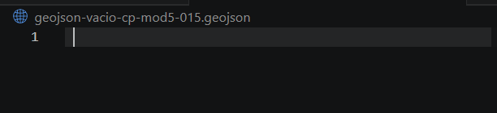

Se observa el archivo GeoJSON utilizado como dato de prueba, el cual no contiene información geográfica ni geometría válida para definir el Área de Interés.

#### Evidencia CP-MOD5-006 — Error al cargar archivo GeoJSON vacío

  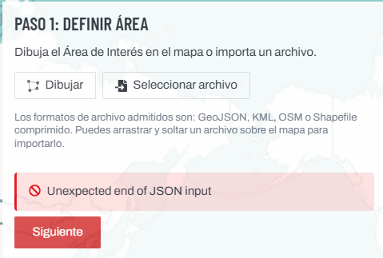

Se evidencia que el sistema rechaza el archivo GeoJSON vacío y muestra un error de validación, impidiendo continuar con el flujo de creación del proyecto.

#### Observación de ejecución

Durante la ejecución se comprobó que el sistema valida el contenido del archivo antes de aceptarlo como Área de Interés. Al detectar que el archivo se encuentra vacío y no contiene geometría válida, bloquea la carga y evita avanzar al siguiente paso.

### 5.1.7. Validación de AOI fuera del área permitida

**CP-MOD5-007**

| ID              | Descripción                                                                                                                             | Tipo   | Estado  | Defectos                    |
| :-------------- | :-------------------------------------------------------------------------------------------------------------------------------------- | :----- | :------ | :-------------------------- |
| **CP-MOD5-007** | Verificar que el sistema rechace o bloquee un Área de Interés que excede las restricciones permitidas durante la creación del proyecto. | Manual | Exitoso | No se encontraron defectos. |

| Resultado esperado                                                                                                                            | Resultado obtenido                                                                                                                                                                    |
| :-------------------------------------------------------------------------------------------------------------------------------------------- | :------------------------------------------------------------------------------------------------------------------------------------------------------------------------------------ |
| El sistema debe rechazar el AOI o impedir el avance cuando el área cargada excede las restricciones permitidas para la creación del proyecto. | El sistema cargó la validación correspondiente y no permitió avanzar con el AOI ingresado, evitando continuar el flujo de creación con un área fuera de las restricciones permitidas. |

#### Evidencia CP-MOD5-007 — GeoJSON con AOI fuera del área permitida

  

Se observa el contenido del archivo GeoJSON utilizado como dato de prueba. Aunque el archivo tiene una estructura válida, representa un Área de Interés demasiado grande para las restricciones esperadas del sistema.

#### Evidencia CP-MOD5-007 — Validación de AOI fuera del área permitida

  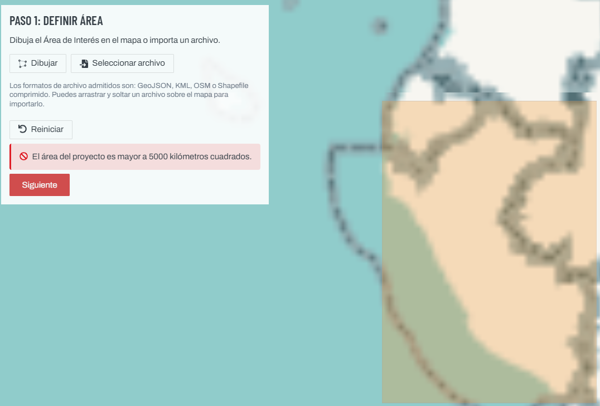

Se evidencia que el sistema no permitió avanzar con el AOI cargado, mostrando una validación o bloqueo asociado al tamaño o restricciones del Área de Interés.

#### Observación de ejecución

Durante la ejecución se comprobó que el sistema controla las restricciones del Área de Interés antes de permitir continuar con la generación de tareas. Al identificar que el AOI excede las condiciones permitidas, bloquea el avance y evita que se genere una grilla basada en un área no válida.

### 5.2.1. Validación de campos obligatorios al guardar proyecto

**CP-MOD5-008**

| ID              | Descripción                                                                                                                              | Tipo   | Estado  | Defectos                    |
| :-------------- | :--------------------------------------------------------------------------------------------------------------------------------------- | :----- | :------ | :-------------------------- |
| **CP-MOD5-008** | Verificar que el sistema impida guardar un proyecto cuando existen campos obligatorios incompletos en la configuración del proyecto. | Manual | Exitoso | No se encontraron defectos. |

| Resultado esperado                                                                                                                                      | Resultado obtenido                                                                                                                                                                                                                                                                                  |
| :------------------------------------------------------------------------------------------------------------------------------------------------------ | :-------------------------------------------------------------------------------------------------------------------------------------------------------------------------------------------------------------------------------------------------------------------------------------------------- |
| El sistema debe rechazar el guardado del proyecto si faltan campos obligatorios como descripción, instrucciones o tipo de mapeo, mostrando un mensaje de validación comprensible para el usuario. | El sistema impidió guardar el proyecto y mostró un mensaje de validación indicando que falta información en el idioma predeterminado del proyecto, específicamente **Descripción corta**, **Descripción**, **Instrucciones detalladas** y el campo obligatorio **Tipos de mapeo**. |

#### Evidencia CP-MOD5-008 — Proyecto con campos obligatorios incompletos

  

Se observa la pantalla de edición del proyecto con secciones obligatorias pendientes de completar, como descripción, instrucciones y metadatos.

#### Evidencia CP-MOD5-008 — Validación de campos obligatorios

  

Se evidencia que el sistema bloqueó el guardado del proyecto y mostró un mensaje de validación detallando los campos obligatorios faltantes. Esto confirma que el sistema controla entradas incompletas antes de guardar la configuración del proyecto.

### 5.2.2. Guardado de proyecto con campos obligatorios completos

**CP-MOD5-009**

| ID              | Descripción                                                                                                                          | Tipo   | Estado  | Defectos                    |
| :-------------- | :----------------------------------------------------------------------------------------------------------------------------------- | :----- | :------ | :-------------------------- |
| **CP-MOD5-009** | Verificar que el sistema permita guardar un proyecto cuando los campos obligatorios de descripción, instrucciones y metadatos han sido completados correctamente. | Manual | Exitoso | No se encontraron defectos. |

| Resultado esperado                                                                                                                                          | Resultado obtenido                                                                                                                                                 |
| :---------------------------------------------------------------------------------------------------------------------------------------------------------- | :----------------------------------------------------------------------------------------------------------------------------------------------------------------- |
| El sistema debe permitir guardar el proyecto cuando los campos obligatorios se encuentran completos y válidos, mostrando una confirmación de actualización exitosa. | El sistema guardó correctamente la configuración del proyecto y mostró el mensaje **“Proyecto actualizado correctamente.”**. |

#### Evidencia CP-MOD5-009 — Campos obligatorios completados

<table>
  <tr>
    <td align="center">
      
       
      <strong>Descripción completada</strong>
    </td>
    <td align="center">
      
       
      <strong>Instrucciones completadas</strong>
    </td>
    <td align="center">
      
       
      <strong>Metadatos completados</strong>
    </td>
  </tr>
</table>

Se observa que el usuario completó las secciones obligatorias del proyecto: descripción, instrucciones y metadatos, incluyendo el tipo de mapeo requerido por el sistema.
#### Evidencia CP-MOD5-009 — Proyecto guardado exitosamente

  

Se evidencia que el sistema aceptó la información ingresada y mostró el mensaje **“Proyecto actualizado correctamente.”**, confirmando que el proyecto fue guardado sin defectos.
### 5.2.3. Modificación del nombre del proyecto

**CP-MOD5-010**

| ID              | Descripción                                                                                                 | Tipo   | Estado  | Defectos                    |
| :-------------- | :---------------------------------------------------------------------------------------------------------- | :----- | :------ | :-------------------------- |
| **CP-MOD5-010** | Verificar que el sistema permita modificar el nombre de un proyecto existente desde la pantalla de edición. | Manual | Exitoso | No se encontraron defectos. |

| Resultado esperado                                                                                                                                | Resultado obtenido                                                                                                             |
| :------------------------------------------------------------------------------------------------------------------------------------------------ | :----------------------------------------------------------------------------------------------------------------------------- |
| El sistema debe permitir modificar el nombre del proyecto, guardar el cambio y mostrar el nuevo nombre correctamente después de la actualización. | El sistema permitió modificar el nombre del proyecto, guardar los cambios y mostrar correctamente el nuevo nombre actualizado. |

#### Evidencia CP-MOD5-010 — Nombre inicial del proyecto

  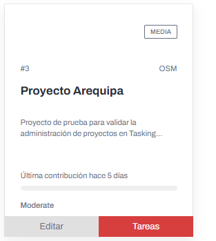

Se observa el nombre inicial del proyecto antes de realizar la modificación desde la pantalla de edición.

#### Evidencia CP-MOD5-010 — Nombre del proyecto modificado

  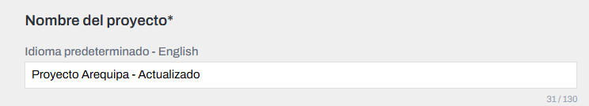

Se evidencia que el usuario ingresó un nuevo nombre válido para el proyecto antes de guardar los cambios.

#### Evidencia CP-MOD5-010 — Nombre actualizado guardado correctamente

  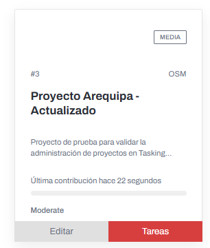

Se evidencia que el sistema guardó correctamente el nuevo nombre del proyecto y lo muestra actualizado en la interfaz.

#### Observación de ejecución

Durante la ejecución se comprobó que el sistema permite editar el nombre de un proyecto existente y conservar el cambio después de guardar. No se observaron errores ni pérdida de información durante la actualización.

### 5.2.4. Modificación de la descripción corta del proyecto

**CP-MOD5-011**

| ID              | Descripción                                                                                                            | Tipo   | Estado  | Defectos                    |
| :-------------- | :--------------------------------------------------------------------------------------------------------------------- | :----- | :------ | :-------------------------- |
| **CP-MOD5-011** | Verificar que el sistema permita modificar la descripción corta de un proyecto existente desde la pantalla de edición. | Manual | Exitoso | No se encontraron defectos. |

| Resultado esperado                                                                                                                            | Resultado obtenido                                                                                                                                  |
| :-------------------------------------------------------------------------------------------------------------------------------------------- | :-------------------------------------------------------------------------------------------------------------------------------------------------- |
| El sistema debe permitir modificar la descripción corta del proyecto, guardar el cambio y mostrar una confirmación de actualización correcta. | El sistema permitió modificar la descripción corta del proyecto y mostró una notificación indicando que los cambios fueron guardados correctamente. |

#### Evidencia CP-MOD5-011 — Descripción corta inicial

  

Se observa la descripción corta del proyecto antes de realizar la modificación.

#### Evidencia CP-MOD5-011 — Descripción corta modificada

  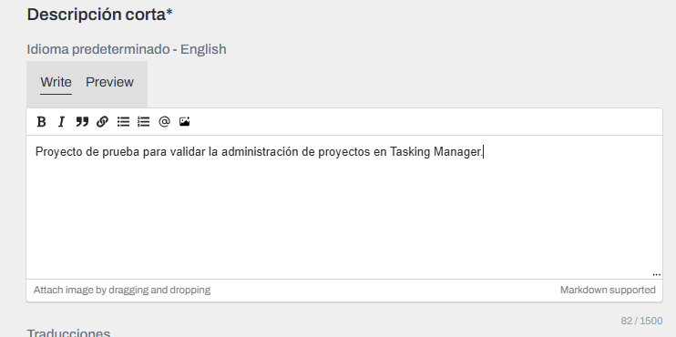

Se evidencia que el usuario ingresó una nueva descripción corta válida en la pantalla de edición del proyecto.

#### Evidencia CP-MOD5-011 — Confirmación de guardado correcto

  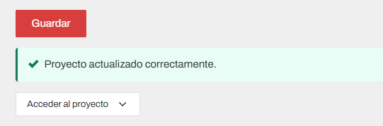

Se evidencia que el sistema mostró una notificación de guardado correcto, confirmando que la modificación de la descripción corta fue procesada exitosamente.

#### Observación de ejecución

Durante la ejecución se comprobó que el sistema permite editar la descripción corta del proyecto y guardar el cambio sin errores visibles. La notificación de confirmación permite verificar que la actualización fue aceptada por el sistema.

### 5.2.5. Modificación de instrucciones detalladas del proyecto

**CP-MOD5-012**

| ID              | Descripción                                                                                                                    | Tipo   | Estado  | Defectos                    |
| :-------------- | :----------------------------------------------------------------------------------------------------------------------------- | :----- | :------ | :-------------------------- |
| **CP-MOD5-012** | Verificar que el sistema permita modificar las instrucciones detalladas de un proyecto existente desde la pantalla de edición. | Manual | Exitoso | No se encontraron defectos. |

| Resultado esperado                                                                                                                                                   | Resultado obtenido                                                                                                                                                            |
| :------------------------------------------------------------------------------------------------------------------------------------------------------------------- | :---------------------------------------------------------------------------------------------------------------------------------------------------------------------------- |
| El sistema debe permitir modificar las instrucciones detalladas del proyecto, guardar los cambios y mantener el contenido actualizado en la sección correspondiente. | El sistema permitió modificar las instrucciones detalladas del proyecto y guardó correctamente los cambios, mostrando el contenido actualizado en la sección correspondiente. |

#### Evidencia CP-MOD5-012 — Instrucciones detalladas iniciales

  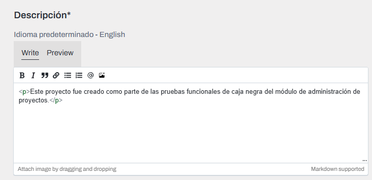

Se observa el contenido inicial de las instrucciones detalladas del proyecto antes de realizar la modificación.

#### Evidencia CP-MOD5-012 — Instrucciones detalladas modificadas

  

Se evidencia que el usuario ingresó nuevas instrucciones detalladas válidas desde la pantalla de edición del proyecto.

#### Evidencia CP-MOD5-012 — Instrucciones detalladas guardadas correctamente

  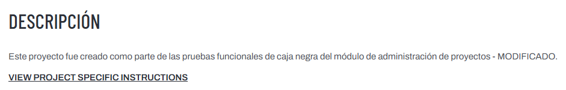

Se evidencia que el sistema mostró o mantuvo las instrucciones detalladas actualizadas, confirmando que la modificación fue procesada correctamente.

#### Observación de ejecución

Durante la ejecución se comprobó que el sistema permite editar las instrucciones detalladas del proyecto y conservar los cambios después del guardado. No se observaron errores visibles ni pérdida de información durante la actualización.

### 5.2.6. Validación de guardado sin cambios en la configuración del proyecto

**CP-MOD5-013**

| ID              | Descripción                                                                                                                            | Tipo   | Estado  | Defectos                    |
| :-------------- | :------------------------------------------------------------------------------------------------------------------------------------- | :----- | :------ | :-------------------------- |
| **CP-MOD5-013** | Verificar que el sistema permita guardar la configuración de un proyecto sin realizar modificaciones visibles en los campos editables. | Manual | Exitoso | No se encontraron defectos. |

| Resultado esperado                                                                                                                                     | Resultado obtenido                                                                                                                             |
| :----------------------------------------------------------------------------------------------------------------------------------------------------- | :--------------------------------------------------------------------------------------------------------------------------------------------- |
| El sistema debe permitir guardar la configuración sin realizar cambios, mantener la información existente y no presentar errores durante la operación. | El sistema permitió guardar la configuración del proyecto sin realizar modificaciones visibles y mostró una confirmación de guardado correcto. |

#### Evidencia CP-MOD5-013 — Configuración sin modificación

  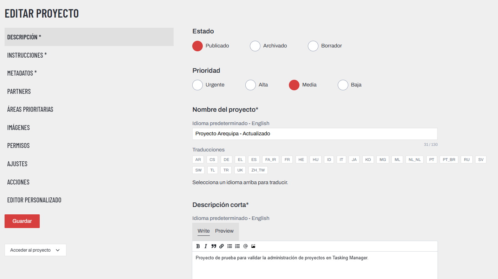

Se observa la pantalla de configuración del proyecto sin modificaciones visibles realizadas por el usuario antes de ejecutar la acción de guardado.

#### Evidencia CP-MOD5-013 — Confirmación de guardado sin cambios

  

Se evidencia que el sistema mostró una confirmación de guardado correcto aun cuando no se realizaron cambios visibles en la configuración del proyecto.

#### Observación de ejecución

Durante la ejecución se comprobó que el sistema permite guardar la configuración del proyecto sin modificar campos. La información existente se mantuvo estable y no se presentaron errores visibles durante la operación.

### 5.3.1. Publicación del proyecto desde estado Borrador

**CP-MOD5-014**

| ID              | Descripción                                                                                                                  | Tipo   | Estado  | Defectos                    |
| :-------------- | :--------------------------------------------------------------------------------------------------------------------------- | :----- | :------ | :-------------------------- |
| **CP-MOD5-014** | Verificar que el sistema permita cambiar el estado de un proyecto desde **Borrador** hacia **Publicado** cuando la configuración obligatoria se encuentra completa. | Manual | Exitoso | No se encontraron defectos. |

| Resultado esperado                                                                                                                                              | Resultado obtenido                                                                                                                                                     |
| :-------------------------------------------------------------------------------------------------------------------------------------------------------------- | :--------------------------------------------------------------------------------------------------------------------------------------------------------------------- |
| El sistema debe permitir cambiar el estado del proyecto de **Borrador** a **Publicado**, guardar la modificación y mostrar una confirmación de actualización exitosa. | El sistema permitió seleccionar el estado **Publicado**, guardó correctamente el cambio y mostró la confirmación de actualización del proyecto. |

#### Evidencia CP-MOD5-014 — Estado inicial Borrador

  

Se observa que el proyecto se encuentra inicialmente en estado **Borrador**, antes de realizar la transición de estado.

#### Evidencia CP-MOD5-014 — Estado Publicado seleccionado

  

Se observa que el usuario seleccionó el estado **Publicado** como nuevo estado del proyecto.

#### Evidencia CP-MOD5-014 — Proyecto publicado correctamente

  

Se evidencia que el sistema guardó correctamente el cambio de estado y confirmó la actualización del proyecto. Esto demuestra que la transición **Borrador → Publicado** fue realizada correctamente desde la interfaz.
### 5.3.2. Intento de publicar proyecto con campos obligatorios incompletos

**CP-MOD5-015**

| ID              | Descripción                                                                                          | Tipo   | Estado  | Defectos                    |
| :-------------- | :--------------------------------------------------------------------------------------------------- | :----- | :------ | :-------------------------- |
| **CP-MOD5-015** | Verificar que el sistema impida publicar un proyecto cuando existen campos obligatorios incompletos. | Manual | Exitoso | No se encontraron defectos. |

| Resultado esperado                                                                                                                                  | Resultado obtenido                                                                                                                         |
| :-------------------------------------------------------------------------------------------------------------------------------------------------- | :----------------------------------------------------------------------------------------------------------------------------------------- |
| El sistema debe impedir la publicación del proyecto si faltan campos obligatorios, mostrando mensajes de validación sobre la información requerida. | El sistema no permitió publicar el proyecto y mostró un error indicando que faltaba información obligatoria para completar la publicación. |

#### Evidencia CP-MOD5-015 — Proyecto en borrador con información incompleta

  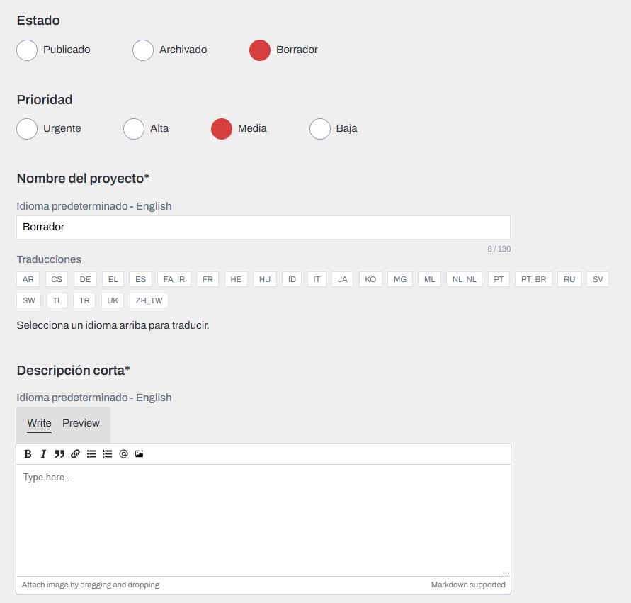

Se observa el proyecto en estado de edición/borrador con información obligatoria incompleta antes de intentar su publicación.

#### Evidencia CP-MOD5-015 — Intento de publicación del proyecto incompleto

  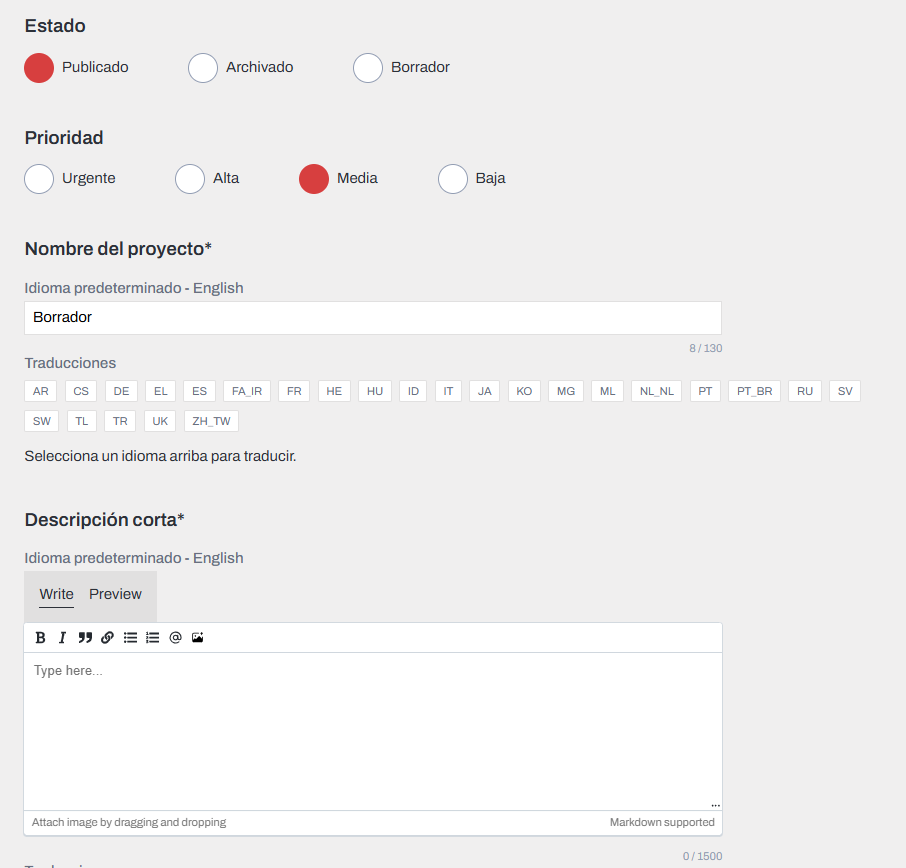

Se evidencia el intento de cambiar el estado del proyecto a publicado sin contar con toda la información obligatoria requerida.

#### Evidencia CP-MOD5-015 — Validación por información incompleta

  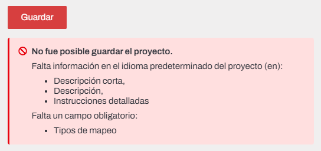

Se evidencia que el sistema mostró un mensaje de validación indicando que faltaba información obligatoria, impidiendo la publicación del proyecto.

#### Observación de ejecución

Durante la ejecución se comprobó que el sistema valida la información obligatoria antes de permitir la publicación de un proyecto. Al detectar campos incompletos, bloqueó el cambio de estado y evitó que el proyecto sea publicado sin cumplir las condiciones requeridas.

### 5.3.3. Cambio de estado de proyecto publicado a borrador

**CP-MOD5-016**

| ID              | Descripción                                                                                                          | Tipo   | Estado  | Defectos                    |
| :-------------- | :------------------------------------------------------------------------------------------------------------------- | :----- | :------ | :-------------------------- |
| **CP-MOD5-016** | Verificar que el sistema permita cambiar el estado de un proyecto publicado a borrador desde la pantalla de edición. | Manual | Exitoso | No se encontraron defectos. |

| Resultado esperado                                                                                                                                         | Resultado obtenido                                                                                                           |
| :--------------------------------------------------------------------------------------------------------------------------------------------------------- | :--------------------------------------------------------------------------------------------------------------------------- |
| El sistema debe permitir cambiar el estado del proyecto de Publicado a Borrador, guardar el cambio y mantener el nuevo estado después de la actualización. | El sistema permitió cambiar el estado del proyecto de Publicado a Borrador y guardó correctamente la modificación realizada. |

#### Evidencia CP-MOD5-016 — Proyecto en estado publicado

  

Se observa que el proyecto se encontraba inicialmente en estado **Publicado** antes de realizar la modificación.

#### Evidencia CP-MOD5-016 — Cambio de estado a borrador

  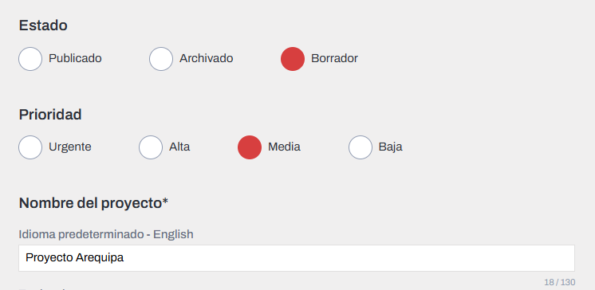

Se evidencia que el usuario seleccionó el estado **Borrador** desde la pantalla de edición del proyecto.

#### Evidencia CP-MOD5-016 — Estado borrador guardado correctamente

  

Se evidencia que el sistema guardó correctamente el cambio de estado, manteniendo el proyecto como **Borrador** después de la actualización.

#### Observación de ejecución

Durante la ejecución se comprobó que el sistema permite revertir el estado de un proyecto publicado a borrador. El cambio fue procesado correctamente y no se presentaron errores visibles durante el guardado.

### 5.4.1. Configuración de permisos del proyecto

**CP-MOD5-017**

| ID              | Descripción                                                                                                                        | Tipo   | Estado  | Defectos                    |
| :-------------- | :--------------------------------------------------------------------------------------------------------------------------------- | :----- | :------ | :-------------------------- |
| **CP-MOD5-017** | Verificar que el sistema permita configurar los permisos de mapeo y validación de un proyecto mediante niveles mínimos de usuario. | Manual | Exitoso | No se encontraron defectos. |

| Resultado esperado                                                                                                                                                      | Resultado obtenido                                                                                                                                                                                                              |
| :---------------------------------------------------------------------------------------------------------------------------------------------------------------------- | :------------------------------------------------------------------------------------------------------------------------------------------------------------------------------------------------------------------------------ |
| El sistema debe permitir modificar los permisos del proyecto, estableciendo niveles mínimos requeridos para mapear y validar, y guardar la configuración correctamente. | El sistema permitió modificar los permisos del proyecto, estableciendo el nivel **INTERMEDIATE** para mapeo y validación. La configuración fue guardada correctamente y permaneció visible en la sección de equipos y permisos. |

#### Evidencia CP-MOD5-017 — Pantalla inicial de permisos

  

Se observa la sección de permisos del proyecto, donde el sistema permite definir qué usuarios pueden mapear y validar, así como los niveles mínimos requeridos para cada acción.

#### Evidencia CP-MOD5-017 — Nivel mínimo de mapeo modificado

  

Se observa que el usuario modificó la configuración de permisos, estableciendo un nivel mínimo requerido para acceder a las acciones del proyecto.

#### Evidencia CP-MOD5-017 — Permisos guardados correctamente

  

Se evidencia que el sistema guardó correctamente la configuración de permisos, mostrando que todos los usuarios con nivel **INTERMEDIATE** o superior pueden mapear y validar el proyecto.

### 5.4.2. Activación de privacidad del proyecto

**CP-MOD5-018**

| ID              | Descripción                                                                                                                 | Tipo   | Estado  | Defectos                    |
| :-------------- | :-------------------------------------------------------------------------------------------------------------------------- | :----- | :------ | :-------------------------- |
| **CP-MOD5-018** | Verificar que el sistema permita activar la opción de proyecto privado dentro de la configuración de permisos del proyecto. | Manual | Exitoso | No se encontraron defectos. |

| Resultado esperado                                                                                                                                         | Resultado obtenido                                                                                                                                                     |
| :--------------------------------------------------------------------------------------------------------------------------------------------------------- | :--------------------------------------------------------------------------------------------------------------------------------------------------------------------- |
| El sistema debe permitir activar la privacidad del proyecto, guardar la configuración y mantener activa la opción **Proyecto privado** después de guardar. | El sistema permitió activar la opción **Proyecto privado**, guardó correctamente el cambio y mantuvo la configuración aplicada en la sección de permisos del proyecto. |

#### Evidencia CP-MOD5-018 — Privacidad inicial del proyecto

  

Se observa la sección de privacidad del proyecto antes de realizar la modificación, donde la opción **Proyecto privado** se encuentra inicialmente desactivada.

#### Evidencia CP-MOD5-018 — Proyecto privado activado

  

Se observa que el usuario activó la opción **Proyecto privado**, modificando la configuración de acceso al proyecto.

#### Evidencia CP-MOD5-018 — Privacidad guardada correctamente

  

Se evidencia que el sistema guardó correctamente la configuración de privacidad del proyecto. Esto confirma que la opción de proyecto privado puede ser modificada desde la interfaz y persistida correctamente.

### 5.4.3. Transferencia de propiedad del proyecto

**CP-MOD5-019**

| ID              | Descripción                                                                                                                                              | Tipo   | Estado  | Defectos                    |
| :-------------- | :------------------------------------------------------------------------------------------------------------------------------------------------------- | :----- | :------ | :-------------------------- |
| **CP-MOD5-019** | Verificar que el sistema permita transferir la propiedad de un proyecto a otro usuario administrador de Tasking Manager perteneciente a la organización. | Manual | Exitoso | No se encontraron defectos. |

| Resultado esperado                                                                                                                                                                           | Resultado obtenido                                                                                                                                                         |
| :------------------------------------------------------------------------------------------------------------------------------------------------------------------------------------------- | :------------------------------------------------------------------------------------------------------------------------------------------------------------------------- |
| El sistema debe permitir seleccionar un nuevo propietario válido del proyecto y transferir la propiedad cuando el usuario seleccionado tiene permisos suficientes dentro de Tasking Manager. | El sistema permitió seleccionar otro administrador de Tasking Manager perteneciente a la organización y realizar correctamente la transferencia de propiedad del proyecto. |

#### Evidencia CP-MOD5-019 — Formulario de transferencia de propiedad

  

Se observa la sección de transferencia de propiedad del proyecto. El sistema muestra una advertencia indicando que esta acción no se puede deshacer, lo cual informa al usuario sobre el impacto de la operación antes de ejecutarla.

#### Evidencia CP-MOD5-019 — Selección de nuevo propietario

  

Se observa que el usuario seleccionó como nuevo propietario a otro administrador de Tasking Manager perteneciente a la organización, cumpliendo la condición requerida para realizar la transferencia.

#### Evidencia CP-MOD5-019 — Propiedad transferida correctamente

  

Se evidencia que el sistema ejecutó correctamente la transferencia de propiedad del proyecto. Esto confirma que la funcionalidad permite cambiar el propietario del proyecto hacia otro usuario con permisos suficientes dentro de la organización.
### 5.4.4. Configuración de dificultad del proyecto

**CP-MOD5-020**

| ID              | Descripción                                                                                                     | Tipo   | Estado  | Defectos                    |
| :-------------- | :-------------------------------------------------------------------------------------------------------------- | :----- | :------ | :-------------------------- |
| **CP-MOD5-020** | Verificar que el sistema permita modificar la dificultad de un proyecto existente desde la pantalla de edición. | Manual | Exitoso | No se encontraron defectos. |

| Resultado esperado                                                                                                                                              | Resultado obtenido                                                                                   |
| :-------------------------------------------------------------------------------------------------------------------------------------------------------------- | :--------------------------------------------------------------------------------------------------- |
| El sistema debe permitir seleccionar una dificultad válida para el proyecto, guardar el cambio y mantener la dificultad actualizada después de la modificación. | El sistema permitió modificar la dificultad del proyecto y guardó correctamente el cambio realizado. |

#### Evidencia CP-MOD5-020 — Dificultad inicial del proyecto

  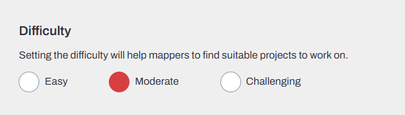

Se observa la dificultad inicial configurada en el proyecto antes de realizar la modificación.

#### Evidencia CP-MOD5-020 — Dificultad modificada

  

Se evidencia que el usuario seleccionó una nueva dificultad válida desde la pantalla de edición del proyecto.

#### Evidencia CP-MOD5-020 — Dificultad guardada correctamente

  

Se evidencia que el sistema guardó correctamente el cambio de dificultad del proyecto, sin mostrar errores visibles.

#### Observación de ejecución

Durante la ejecución se comprobó que el sistema permite modificar la dificultad del proyecto y guardar el cambio correctamente. La operación se completó sin errores visibles en la interfaz.

### 5.4.5. Configuración de prioridad del proyecto

**CP-MOD5-021**

| ID              | Descripción                                                                                                    | Tipo   | Estado  | Defectos                    |
| :-------------- | :------------------------------------------------------------------------------------------------------------- | :----- | :------ | :-------------------------- |
| **CP-MOD5-021** | Verificar que el sistema permita modificar la prioridad de un proyecto existente desde la pantalla de edición. | Manual | Exitoso | No se encontraron defectos. |

| Resultado esperado                                                                                                                                            | Resultado obtenido                                                                                  |
| :------------------------------------------------------------------------------------------------------------------------------------------------------------ | :-------------------------------------------------------------------------------------------------- |
| El sistema debe permitir seleccionar una prioridad válida para el proyecto, guardar el cambio y mantener la prioridad actualizada después de la modificación. | El sistema permitió modificar la prioridad del proyecto y guardó correctamente el cambio realizado. |

#### Evidencia CP-MOD5-021 — Prioridad inicial del proyecto

  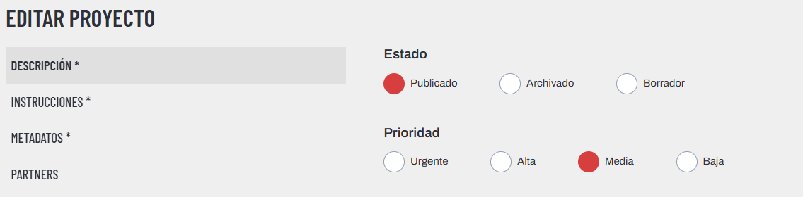

Se observa la prioridad inicial configurada en el proyecto antes de realizar la modificación.

#### Evidencia CP-MOD5-021 — Prioridad modificada

  

Se evidencia que el usuario seleccionó una nueva prioridad válida desde la pantalla de edición del proyecto.

#### Evidencia CP-MOD5-021 — Prioridad guardada correctamente

  

Se evidencia que el sistema guardó correctamente el cambio de prioridad del proyecto, sin mostrar errores visibles.

#### Observación de ejecución

Durante la ejecución se comprobó que el sistema permite modificar la prioridad del proyecto y guardar el cambio correctamente. La operación se completó sin errores visibles en la interfaz.

### 5.5.1. Clonación de proyecto existente

**CP-MOD5-022**

| ID              | Descripción                                                                                                                               | Tipo   | Estado  | Defectos                    |
| :-------------- | :---------------------------------------------------------------------------------------------------------------------------------------- | :----- | :------ | :-------------------------- |
| **CP-MOD5-022** | Verificar que el sistema permita clonar un proyecto existente y generar un nuevo proyecto basado en la información del proyecto original. | Manual | Exitoso | No se encontraron defectos. |

| Resultado esperado                                                                                                                                                                 | Resultado obtenido                                                                                                                                                                                             |
| :--------------------------------------------------------------------------------------------------------------------------------------------------------------------------------- | :------------------------------------------------------------------------------------------------------------------------------------------------------------------------------------------------------------- |
| El sistema debe permitir iniciar el flujo de clonación desde un proyecto existente, conservar la información base del proyecto original y generar un nuevo proyecto independiente. | El sistema inició correctamente el flujo de clonación del proyecto **#1 Proyecto Arequipa** y generó un nuevo proyecto clonado identificado como **#3 Proyecto Arequipa**, visible en el listado de proyectos. |

#### Evidencia CP-MOD5-022 — Opción de clonar proyecto

  

Se observa la opción que permite iniciar la clonación de un proyecto existente desde las acciones disponibles para el proyecto.

#### Evidencia CP-MOD5-022 — Flujo de clonación iniciado

  

Se evidencia que el sistema inició el flujo de clonación e indicó que el nuevo proyecto será un clon del proyecto **#1 Proyecto Arequipa**.

#### Evidencia CP-MOD5-022 — Revisión del proyecto clonado

  

Se observa el paso de revisión del proyecto clonado antes de finalizar su creación.

#### Evidencia CP-MOD5-022 — Proyecto clonado creado correctamente

  

Se evidencia que el sistema creó correctamente un nuevo proyecto clonado. En el listado se muestran dos proyectos: el proyecto original **#1 Proyecto Arequipa** y el proyecto clonado **#3 Proyecto Arequipa**, confirmando que la clonación fue ejecutada correctamente.

### 5.5.2. Eliminación controlada de proyecto

**CP-MOD5-023**

| ID              | Descripción                                                                                                                                               | Tipo   | Estado  | Defectos                    |
| :-------------- | :-------------------------------------------------------------------------------------------------------------------------------------------------------- | :----- | :------ | :-------------------------- |
| **CP-MOD5-023** | Verificar que el sistema permita eliminar un proyecto desde la sección de acciones y redirija correctamente al usuario después de completar la operación. | Manual | Exitoso | No se encontraron defectos. |

| Resultado esperado                                                                                                                                                                                                     | Resultado obtenido                                                                                                                                                             |
| :--------------------------------------------------------------------------------------------------------------------------------------------------------------------------------------------------------------------- | :----------------------------------------------------------------------------------------------------------------------------------------------------------------------------- |
| El sistema debe permitir eliminar un proyecto mediante una acción controlada, mostrar una confirmación o advertencia antes de ejecutar la operación y redirigir al usuario a una vista adecuada después de eliminarlo. | El sistema eliminó correctamente el proyecto seleccionado y redirigió al usuario a la vista de gestión de proyectos, confirmando que la operación fue ejecutada correctamente. |

#### Evidencia CP-MOD5-023 — Opción de eliminar proyecto

  

Se observa la opción disponible para eliminar el proyecto desde la sección de acciones. Esta funcionalidad permite al usuario autorizado iniciar una operación sensible sobre el proyecto.

#### Evidencia CP-MOD5-023 — Confirmación de eliminación

  

Se observa la confirmación o advertencia previa a la eliminación del proyecto, lo cual permite evitar una eliminación accidental.

#### Evidencia CP-MOD5-023 — Proyecto eliminado y redirección a gestión de proyectos

  

Se evidencia que el sistema eliminó correctamente el proyecto y redirigió al usuario a la vista de gestión de proyectos. Esto confirma que la eliminación fue procesada de forma controlada desde la interfaz.

### 5.5.3. Configuración de fuente de imágenes del proyecto

**CP-MOD5-024**

| ID              | Descripción                                                                                                                     | Tipo   | Estado  | Defectos                    |
| :-------------- | :------------------------------------------------------------------------------------------------------------------------------ | :----- | :------ | :-------------------------- |
| **CP-MOD5-024** | Verificar que el sistema permita seleccionar una fuente de imágenes válida para el proyecto y guardar correctamente la configuración. | Manual | Exitoso | No se encontraron defectos. |

| Resultado esperado                                                                                                                                        | Resultado obtenido                                                                                                                                               |
| :-------------------------------------------------------------------------------------------------------------------------------------------------------- | :--------------------------------------------------------------------------------------------------------------------------------------------------------------- |
| El sistema debe permitir seleccionar una fuente de imágenes válida para el proyecto, guardar la configuración y mantener visible la opción seleccionada. | El sistema permitió seleccionar la fuente de imágenes **Bing**, guardó correctamente la configuración y mostró el mensaje de actualización exitosa del proyecto. |

#### Evidencia CP-MOD5-024 — Pantalla inicial de imágenes

  

Se observa la sección **Imágenes** del proyecto, donde el sistema presenta distintas fuentes de imágenes disponibles para configurar el mapeo del proyecto, tales como Bing, Mapbox Satellite, ESRI World Imagery y Maxar Standard.

#### Evidencia CP-MOD5-024 — Fuente Bing seleccionada y guardada correctamente

  

Se evidencia que el usuario seleccionó la fuente de imágenes **Bing** y que el sistema guardó correctamente la configuración, confirmando que la fuente de mapeo fue actualizada sin defectos.
### 5.5.4. Cancelación de eliminación de proyecto

**CP-MOD5-025**

| ID              | Descripción                                                                                              | Tipo   | Estado  | Defectos                    |
| :-------------- | :------------------------------------------------------------------------------------------------------- | :----- | :------ | :-------------------------- |
| **CP-MOD5-025** | Verificar que el sistema permita cancelar la eliminación de un proyecto antes de confirmar la operación. | Manual | Exitoso | No se encontraron defectos. |

| Resultado esperado                                                                                                                                    | Resultado obtenido                                                                                                                                             |
| :---------------------------------------------------------------------------------------------------------------------------------------------------- | :------------------------------------------------------------------------------------------------------------------------------------------------------------- |
| El sistema debe mostrar una confirmación antes de eliminar el proyecto, permitir cancelar la operación y mantener el proyecto disponible sin cambios. | El sistema permitió cancelar la eliminación del proyecto correctamente. Después de cancelar, el proyecto no fue eliminado y continuó disponible en el sistema. |

#### Evidencia CP-MOD5-025 — Opción de eliminar proyecto

  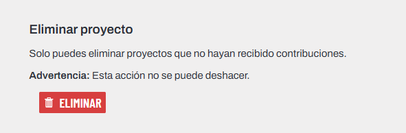

Se observa la opción disponible para iniciar la eliminación del proyecto desde la interfaz de administración.

#### Evidencia CP-MOD5-025 — Confirmación de eliminación

  

Se evidencia que el sistema muestra una ventana o mensaje de confirmación antes de ejecutar la eliminación del proyecto.

#### Evidencia CP-MOD5-025 — Cancelación de eliminación

  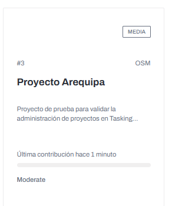

Se evidencia que la operación de eliminación fue cancelada y que el proyecto continuó disponible en el sistema.

#### Observación de ejecución

Durante la ejecución se comprobó que el sistema solicita confirmación antes de eliminar un proyecto. Al cancelar la operación, el proyecto no fue eliminado y se mantuvo disponible, evitando una eliminación accidental.

