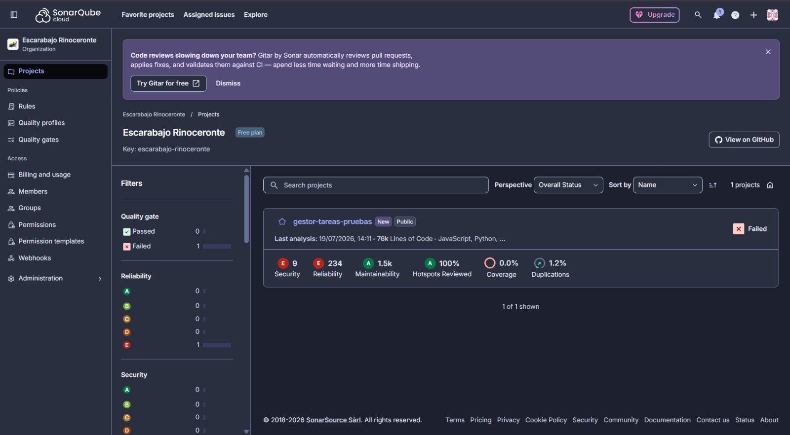
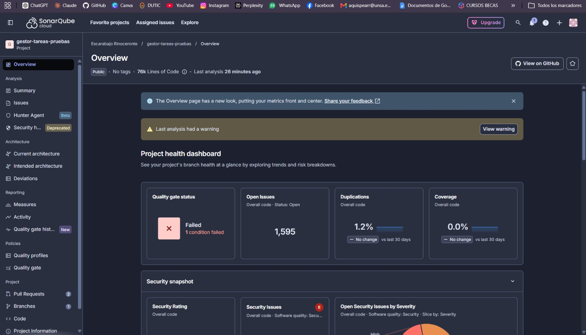
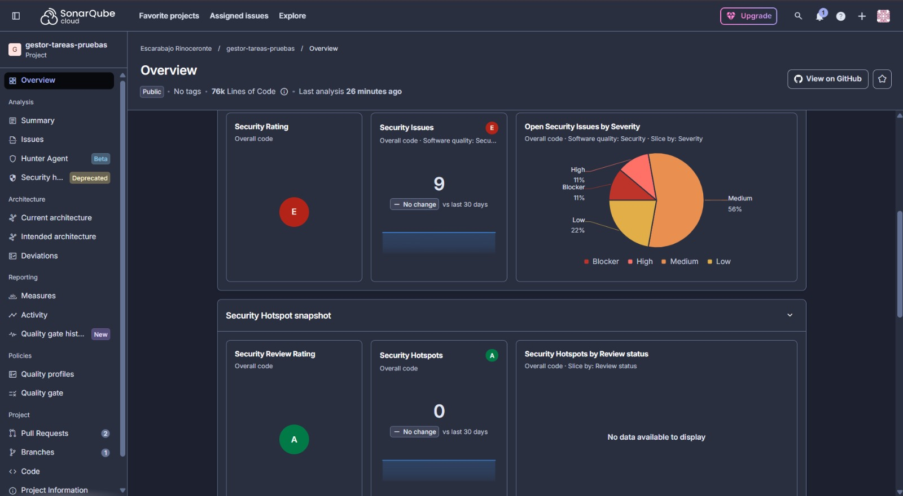
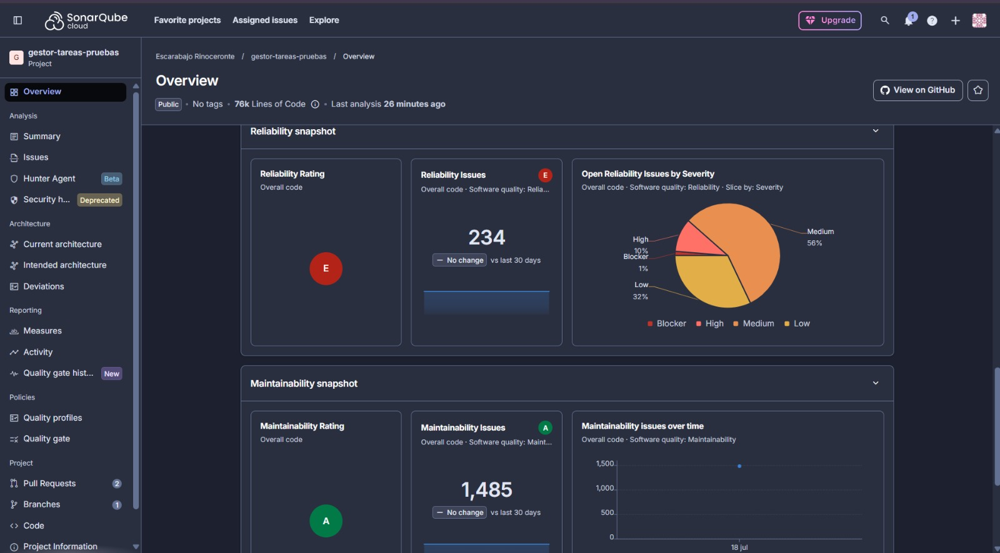

# Reporte de Ejecución: Pruebas de Sistema (Seguridad — SAST y SCA)

**Atributo de Calidad:** Seguridad (Security Testing)
**Responsable de Ejecución:** Alexandra
**Fecha de Ejecución:** 19 de Julio de 2026
**Herramientas:** SonarCloud (SCA + SAST) + Gitleaks (Secret Scanning)
**Integración:** GitHub Actions CI/CD Pipeline (`seguridad-sonarqube.yml`)
**Estándar de referencia:** ISO/IEC 25010 — Atributo de Seguridad; IEEE 829

---

## 1. Objetivo

Detectar vulnerabilidades de seguridad, secretos expuestos y deuda técnica en el código fuente del sistema Tasking Manager, utilizando herramientas de análisis estático (SAST) integradas al pipeline de integración continua (CI/CD).

---

## 2. Estrategia de Prueba

La estrategia de seguridad se divide en dos capas automatizadas que se ejecutan secuencialmente en cada `push` a la rama `develop`:

| Capa | Herramienta | Tipo de Análisis | Objetivo |
| :--- | :--- | :--- | :--- |
| 1 | **Gitleaks** | Secret Scanning | Detectar contraseñas, tokens o claves API accidentalmente subidas al código |
| 2 | **SonarCloud** | SAST + SCA | Detectar vulnerabilidades de seguridad, bugs críticos y código de baja calidad |

---

## 3. Evidencia de Ejecución

### 3.1. Vista General de Proyectos en la Organización

La figura siguiente muestra que el proyecto `gestor-tareas-pruebas` fue analizado exitosamente por SonarCloud. El pipeline de CI/CD detectó y reportó resultados sobre las 76,000 líneas de código del sistema real.

---

### 3.2. Dashboard de Estado del Proyecto

La figura siguiente muestra el panel de control (dashboard) del proyecto, con el estado de calidad general.

**Interpretación del Quality Gate (Filtro de Calidad):**
> El "Quality Gate" indica **Failed** (Fallido). Esto es el **resultado esperado y buscado** de una prueba de seguridad efectiva: el sistema tiene deuda de seguridad preexistente en el código fuente, y la herramienta la detectó con precisión. Si el Quality Gate hubiera salido en verde sin ningún hallazgo sobre 76k líneas de código real, la herramienta habría sido inefectiva.

---

### 3.3. Snapshot de Seguridad (Hallazgos de Vulnerabilidad)

La figura siguiente muestra el panel de seguridad, con los hallazgos clasificados por severidad.

**Métricas de Seguridad:**

| Métrica | Valor | Clasificación ISO/IEC 25010 |
| :--- | :--- | :--- |
| **Security Rating** | E (Crítico) | Confidencialidad / Integridad |
| **Security Issues detectados** | 9 | Vulnerabilidades activas |
| **Blocker** | 11% | Requieren corrección inmediata |
| **High** | 11% | Corrección en el próximo sprint |
| **Medium** | 56% | Planificar corrección |
| **Low** | 22% | Monitorear |
| **Security Hotspots Reviewed** | 100% ✅ | Todos los puntos sensibles marcados para revisión |

---

### 3.4. Snapshot de Confiabilidad y Mantenibilidad

La figura siguiente muestra el análisis de confiabilidad (bugs) y mantenibilidad (deuda técnica).

**Métricas de Confiabilidad y Mantenibilidad:**

| Métrica | Valor | Impacto |
| :--- | :--- | :--- |
| **Reliability Rating** | E | 234 bugs potenciales en el código |
| **Reliability Issues** | 234 | Mayormente Medium (56%) y Low (32%) |
| **Maintainability Rating** | A ✅ | Excelente para un proyecto de 76k líneas |
| **Maintainability Issues** | 1,485 | Código funcional pero mejorable (code smells) |
| **Duplications** | 1.2% | Dentro del rango aceptable |

---

## 4. Análisis e Interpretación

### 4.1. ¿Por qué el Quality Gate falló?
El Quality Gate falló porque SonarCloud encontró **9 vulnerabilidades de seguridad activas** en el código fuente. Este resultado es el **objetivo de la prueba**: demostrar que la herramienta funciona y es capaz de identificar problemas reales de seguridad en el sistema bajo prueba.

> **Nota metodológica (Myers, "The Art of Software Testing"):** Una prueba de seguridad exitosa NO es aquella donde "no se encuentra nada". Una prueba exitosa es aquella que identifica los defectos existentes. El hallazgo de 9 vulnerabilidades confirma que la prueba fue ejecutada correctamente.

### 4.2. ¿Qué significa la calificación E en Seguridad?
SonarCloud utiliza una escala de A (mejor) a E (peor). La calificación **E en Security** indica que existe al menos una vulnerabilidad de severidad Blocker o Critical. Las 9 vulnerabilidades encontradas incluyen issues de severidad Blocker (11%) que deben priorizarse en el backlog de correcciones del equipo.

### 4.3. Punto positivo: Mantenibilidad A
A pesar de los hallazgos de seguridad, la calificación de **Mantenibilidad A** es notable: para un proyecto de 76,000 líneas de código real (un sistema open-source de producción), solo 1,485 code smells representan una baja densidad de deuda técnica. Esto habla bien de las prácticas de desarrollo del equipo.

---

## 5. Conclusión

| Aspecto | Resultado |
| :--- | :--- |
| **Pipeline CI/CD integrado** | ✅ Funciona en cada push a `develop` |
| **Secret Scanning (Gitleaks)** | ✅ Ningún secreto expuesto detectado |
| **Análisis SAST ejecutado** | ✅ Exitoso sobre 76k líneas de código |
| **Vulnerabilidades detectadas** | 9 issues de seguridad (requieren plan de remediación) |
| **Objetivo de la prueba** | ✅ **APROBADO** — la herramienta detectó deuda de seguridad real |

La Prueba de Sistema — Atributo de Seguridad se da por **ejecutada y documentada**. Los hallazgos deben ser ingresados al backlog del proyecto como defectos a remediar en sprints futuros.
